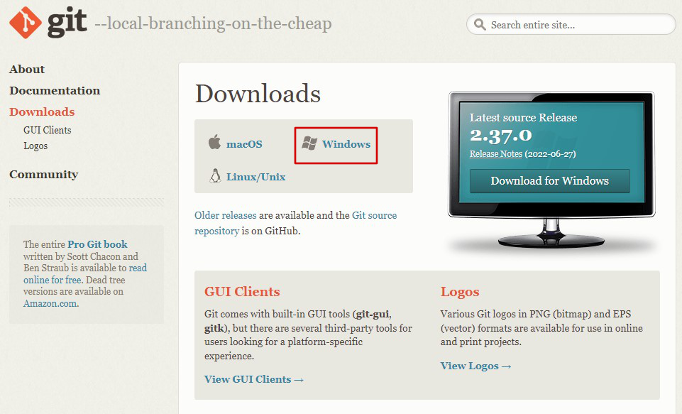
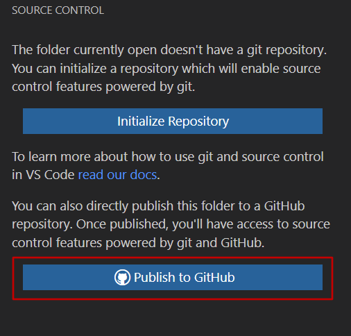
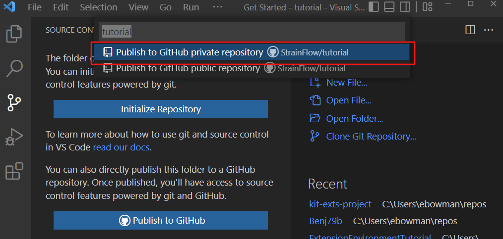
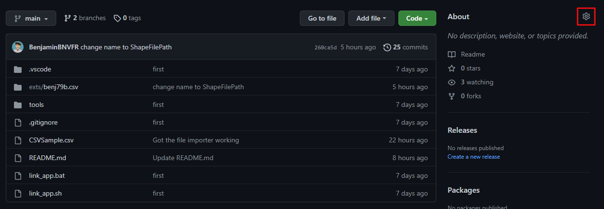
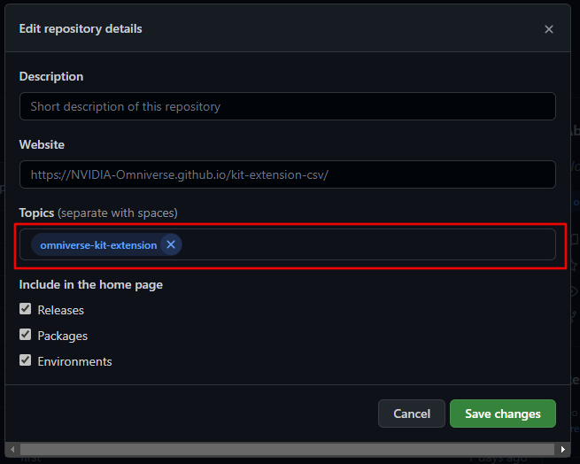
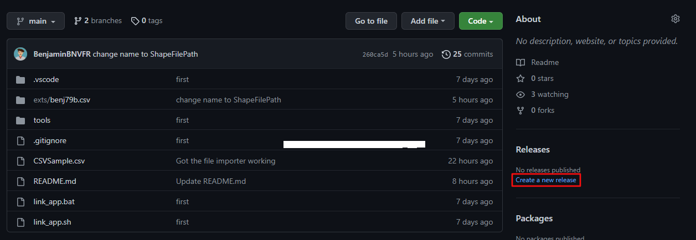
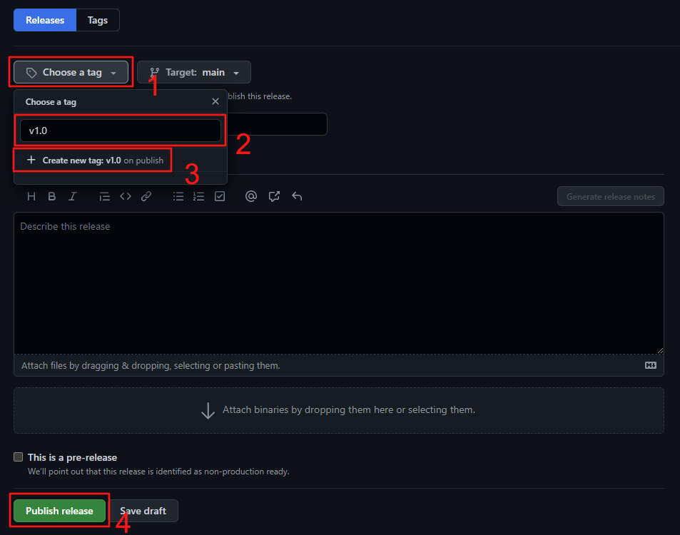

# Setting up your Extension Development Environment

In this tutorial, you set up your computer environment so you can write and publish NVIDIA Omniverse™ extensions.

Check out this video if you only need the GIT portions of this tutorial:

<p align="center">
    <a href="https://www.youtube.com/watch?v=lEQ2VmzXMgQ">
        
    </a>
<p>

## Step 1: Install Omniverse

1. [Download Omniverse for individuals](https://www.nvidia.com/en-us/omniverse/download/#ov-download).
2. Then, follow this video to complete your installation and optionally set up Nucleus:

<p align="center">
    <a href="https://www.youtube.com/watch?v=MbsFBukGOZE">
        
    </a>
<p>

### Step 2: Install Omniverse Code

1. From the Omniverse launcher, navigate to the `Exchange` tab.
2. Search for "code", and click the Omniverse Code app.
3. Click **Install**.

<p align="center">
    
<p>

The installation will proceed automatically from this point.

### Step 3: Install VS Code

1. [Download Visual Studio Code](https://code.visualstudio.com/Download).
2. Perform the standard installation.

<p align="center">
    <a href="https://code.visualstudio.com/">
        
    </a>
<p>

### Step 4: Install Git

1. [Download Git](https://git-scm.com/downloads).
2. Use the default options.

<p align="center">
    <a href="https://git-scm.com/downloads">
        
    </a>
<p>

## Step 5: Create a GitHub Account

[Sign up for GitHub](https://github.com/signup?ref_cta=Sign+up&ref_loc=header+logged+out&ref_page=%2F&source=header-home).

<p align="center">
    <a href="https://github.com/">
        
    </a>
<p>

## Step 6: Create a New Extension

In this section, you create a new extension inside NVIDIA Omniverse™ Code.

### Step 6.1: Launch Code

From the Omniverse Launcher, click **Library**, then **Code**, then **Launch**:

<p align="center">
    
<p>

### Step 6.2: Establish a Project Folder

Choose a folder on your file system where you'll store all of your repositories. For example, `C:/Users/YOUR_USER_NAME/Repos` if you're on Windows. The rest of this tutorial refers to this as your project folder.

### Step 6.3: Create an Extension Template

1. In Omniverse Code, open the *Extensions* panel
2. Click **+**
3. Click `New Extension Template Project`
4. Select your project folder
5. Click **Select**

<p align="center">
    
<p>

### Step 6.4: Name your Extension

1. Name the root folder for your Extension repository
2. Name your Extension

<p align="center">
    
<p>

For the Extension name, use the following convention:

```
<namespace>.<extension_descriptor_1>.<extension_descriptor_2>
```

In this convention, `<namespace>` is a unique name for your personal Extension space. Following your namespace is a series of one or two `<extension_descriptor>` elements. The first word should be general, and the second word, if you have one, should be specific. For example, an Excel reading sample Extension might have the name "UniqueNamespace.Sample.Excel".

When you submit your Extension, Visual Studio Code will be opened to your new Extension's repository.

### Step 6.4: Create Your Extension

Follow our tutorial on [Creating your First Extension](https://developer.nvidia.com/nvidia-omniverse-developer-resource-center#extn_creating). 

> **Join Us:** Join us on [Discord](https://discord.gg/BnEFJvcG) where you can chat with community members and NVIDIA developers and participate in frequent Omniverse hangouts and hack-a-thons.

## Step 7: Create a GIT Repository

In this section, you create a Git repository containing your extension and publish it to GitHub.

### Step 7.1: Create Your Repository

Navigate to the `Source Control` tab in Visual Studio Code:

<p align="center">
    
<p>

### Step 7.2: Publish the Repository to GitHub

Click `Publish to GitHub`: 

<p align="center">
        
<p>

If this is your first time connecting to GitHub from Visual Studio Code, click **Allow** and log in to GitHub.

### Step 7.3: Choose a Public or Private Repository

Click **Publish to GitHub private repository**. 

<p align="center">
        
<p>

You can always change to a public repository when you're ready to share your Extension with the world.

> **Note:** You may have to click through a few more setup prompts before moving on.

### Step 7.4: Open the Repository on GitHub

While learning Git requires its own tutorial, get started with your first commit:

1. Write your code.
2. Go back to the the *Source Control* tab.
3. Write a message in the *Commit Message* box.
4. Click the **check mark** to commit your code.
5. Click the **Sync** button to sync your code with the GitHub server.

> **Note:** You may have to click through a few more setup prompts before moving on.

## Step 8: Release Your Extension to the Omniverse Community

For your Extension to show up in the Omniverse Extensions window, you have to:

1. Add the `omniverse-kit-extension` topic to your repo
2. Create a release
3. Make your repo public

Start by navigating to your project in GitHub.

### 8.1: Add the `omniverse-kit-extension` Topic

Click on the **gear** in the *About* section of your repository.

<p align="center">
    
<p>

In the popup that appears, add `omniverse-kit-extension` to the topics text field:

<p align="center">
    
<p>

Click `Save changes`.

### 8.2: Create a Release

Under *Releases*, click **Create a new release**:

<p align="center">
    
<p>

Once you're on the release page:

1. Click **Choose a tag**
2. Enter a name such as "v1.0" for your tag
3. Click **+ Create a new tag**
4. Click **Publish release**

<p align="center">
    
<p>

### 8.3: Make the Repository Public

When your Extension is complete, and you're ready for it to appear in the Extension catalog within Omniverse, go to your repository settings, scroll down to the *Danger Zone* and make your repository public.

## Conclusion

In this tutorial, you learned how to: 

- Install the software you need to create Omniverse extensions.
- Create a GitHub account.
- Create an Extension.
- Publish your Extension to GitHub.
- Make the Extension available to the community within Omniverse.